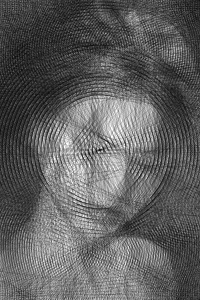

# gray lines
Python program that draws an image using lots of lines. 

  

_Woman. 4096 lines, line width 0.1 pixels_

  

_Skull. 4096 lines, line width 0.1 pixels_

Inspired by this [video](https://www.youtube.com/watch?v=eqm39d4L4zs).

## Algorithm
A few points are generated around the image, all possible combinations of point pairs are considered for the next line. Out of all of these, the line that produces the smalles pixel difference against the target image is selected. The process is continued for a fixed number of lines.

## Author
vidstige
